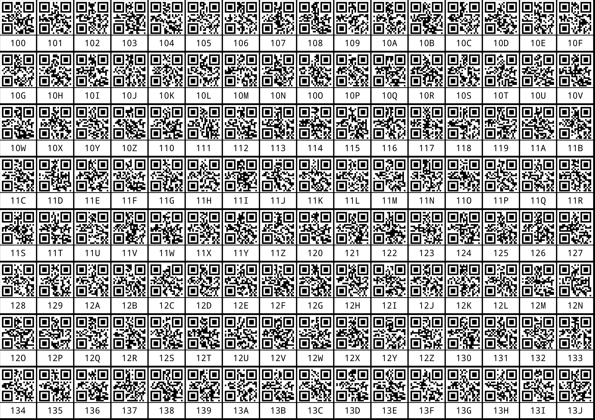

# StampGen

## Building

simply [install D](https://dlang.org) and run
```
dub build
```
in this cloned directory to build.

## Usage

After building you can run:
```
./stamp-gen
```
to generate the default output file.

Example:


This file can then simply be printed onto an A4 paper, best on sticker paper. Adjust page margins in your printing program (like GIMP).

The default values will generate 128 stickers which most printers should easily be able to print while still being scannable. With the options `-n 4 -p` you can generate 256 stickers (in portrait orientation) which can also still be printed by a lot of inkjet printers.

The default values count from 1296 up using a base36 counting system (0-9A-Z). As long as the digits stay 3 letters wide, the default QR text format will always generate a 21x21 QR matrix which fits best. Adjust the text format to be a smaller format for longer numbers.

For example see the .sh files.

Check help:
```
$ ./stamp-gen --help

Inventory stamp image generator
-f       --format The format for the QR code string to use. Insert an %s for the counting variable.
-t         --text The format for the human readable text string to use. Insert an %s for the counting variable.
           --base Characters to use for counting. Use '0123456789' for decimal. Defaults to '0123456789ABCDEFGHIJKLMNOPQRSTUVWXYZ'
-n          --exp How many cuts (exponential) to make. Or: 2^n = the number of stickers on the x axis. One cut cuts the whole page into 4 rectangle, each further cut cuts all rectangles.
-p     --portrait Use portrait mode stickers. If this is given, the stickers will be in size A4, A6, A8, A10, etc. Otherwise stickers will be in size A5, A7, A9, A11, etc.
-d          --dpi DPI of the generated image. Higher DPI means more pixels of same content. QR codes are always pixel perfectly scaled, so various DPI values will simply change paddings between each sticker until they fit at a bigger scale. Defaults to 600
-i        --start The default count to start at. Defaults to 1296
-o          --out The image file to write to. Supported formats determined by extension: .png, .tga, .bmp; Defaults to output.png
           --font The font to write the text with. Defaults to monospace
   --fallbackfont The font to use when characters aren't present in the first font. Defaults to Noto Sans
       --fontsize The font size (in units relative to each sticker size) to use for the human readable text. Defaults to 70
-h         --help This help information.
```

Giving font names without absolute paths (using forward slashes `/`) will require fontconfig to be installed. Giving absolute paths should make this work under windows.

Requires freetype to be installed.

## Use-Cases

Print counting stickers for bins where you store stuff and print stickers you put on stuff you store. Using some inventory management system or ERP system along with a scanner app you can quickly use up stored stuff and later look up in which bins you stored which stuff.
